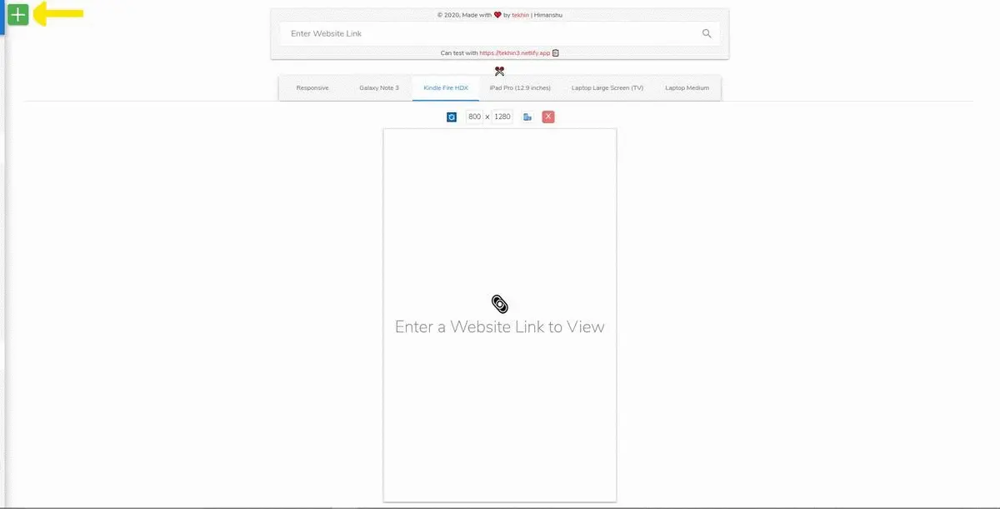
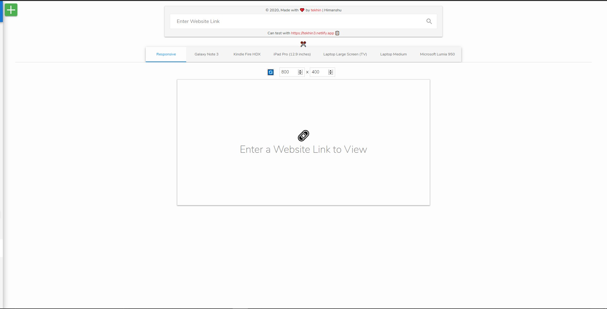
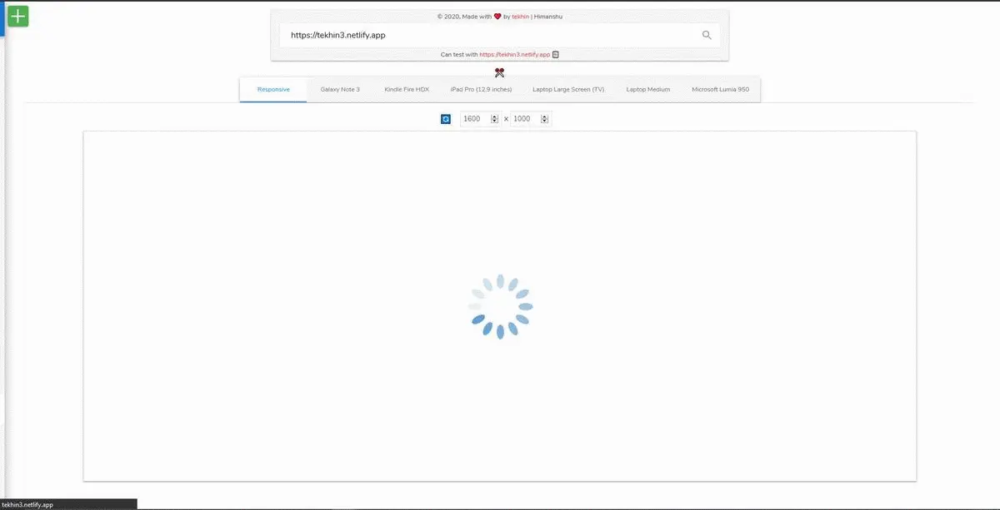

# **Responsiveness Tracker 💻 🖥️ 📱 👈**

 

 

This is the [Responsiveness Tracker](https://hyperloo.github.io/responsivenesstracker) Website built using Reactjs and context API. This enables you to check the responsiveness of your website on different `viewport sizes`.

An App to make `Development and Designing` less hectic and easier to maintain.
 

## **ViewPort List Section ⚙️**

This is the main Select Menu of the viewports categorized into different categories:-  
a) Mobile  
b) Tablet  
b) Laptops  

Note: Can toggle the viewport list using large green "+" button on top.

- You can add given viewport to the list by click left "+" button and delete the selected viewport using "-" before each viewport.
- You can add custom viewport to any of the categories by clicking circular "+" button at the bottom center of each categories and add info of the view port and then click green "✓" button to add to the viewport list or red "x" to discard changes.
- You will get a red "x" delete option on the right of the custom viewport to remove them from the list.

    

## **View Section ✏️📈**

This is the main page of the Web App: Here you can see:-
 

- Input to enter the website link.
    \* You can copy below mentioned link for demo using `copy` button.
- The below list is the selected viewport list which is scrollable on large number of selected viewport.
- You can reset the link using "✂️" button on center top of the list.
    

## **Main Section ✏️📈**

- Here you see the rendered webpage.

- For _responsive_ tab (Mandatory in selected section), you can change dimension using the dimension inputs.
- For rest selected viewport, you can rotate view from portrait to landscape using `Phone rotate button`.
- You can mandate Page reload on viewport change using "🔄" button to tackle the `dynamic stylesheet imports`.
- You can delete the viewport form given selected list by clicking red "X" button.

> You will get the previous changes as it was on reload of the webpage.

**_Hope this webApp will prove to be really helpful in web designing and development._**
